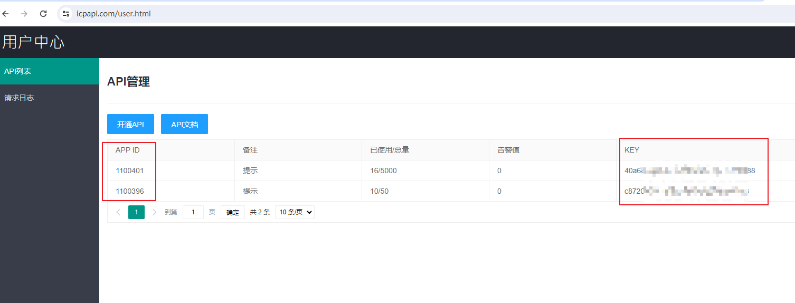
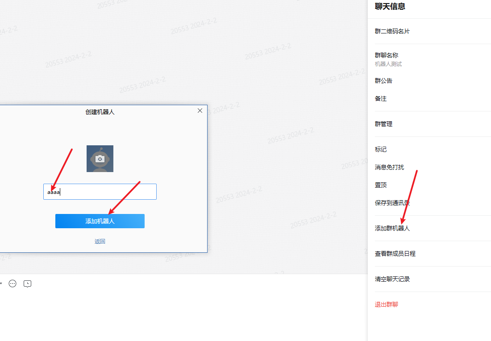
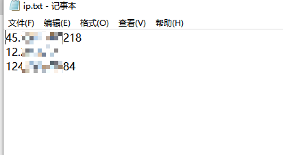
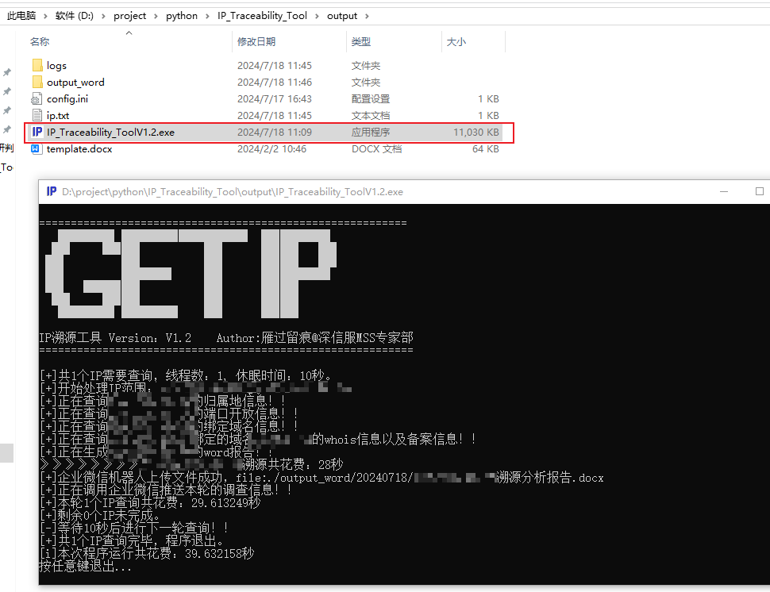
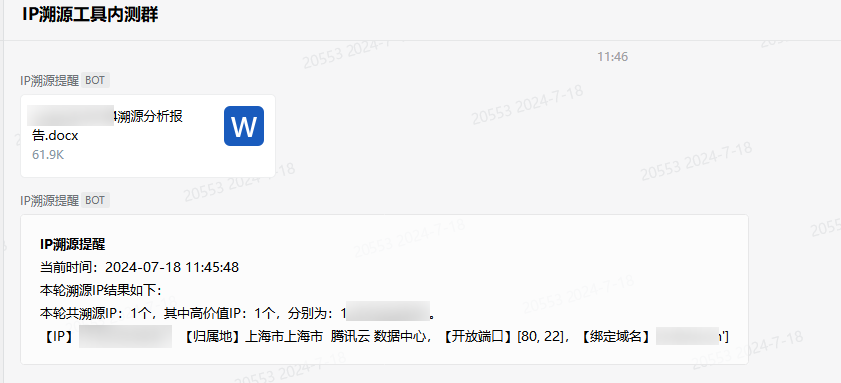

# IP溯源工具使用说明v1.2 

# 一、工具背景

背景：

在攻防演练期间，对于重保值守人员，某些客户要求对攻击IP都进行分析溯源，发现攻击IP的时候，需要针对攻击IP进行分析，如果有关键信息输出报告，针对该需求，产生了这个工具。

# 二、功能实现

## V1.2修改：

1.把基于本地telnet的IP端口查询方式改成调用接口查询。

2.whois信息查询接口单一，增加多个接口，确保whois信息查询的准确性。

3.增加多线程技术，提高程序运行速度。

4.修复cdn查询过长的bug。

6.更新过滤ip地址，现在输入的IP可以加其他字符，会自动过滤出字符串里面存在的IP。

7.增加IP反查域名的接口，新增接口报错和成功写入日志文件。

8.优化更新ip归属地的获取，增加2个接口，确保归属地查询到。

9.端口查询优化，增加端口查询接口。

10.整改企业微信推送方式，从原本一个IP推送一次变成IP查询一轮推送一次，每轮查询的IP个数可以在配置文件里面修改。

11.修改日志输出格式，所有日志输出格式固定。

12.增加每轮查询后程序延时，确保接口不会频繁请求而请求失败。

## V1.1新增：

1.新增将查询到的word报告发送至企业微信。

## v1.0功能：

1.实现支持多IP查询，会自动对IP进行去重，去掉非公网IP，去掉非IP；

2.实现基于IP查询归属地的情况；

3.实现基于IP查询端口开放情况，基于telnet的方式探测端口是否开放，查询端口：`21, 22, 23, 80, 135, 137, 138, 443, 888, 8888, 1433, 3306, 3389, 8080, 8081, 8082, 9090, 9091, 9092, 50050`​；

4.实现基于IP查询域名绑定的情况；

5.实现基于查询出的域名查询whois和icp备案的情况；

6.实现整合内容输出为文本文件和word文件，如果一个IP没有绑定域名，那么认为这个IP没有价值，则输出文本文件，如果绑定了域名，则输出word；

7.实现将内容输出至企业微信机器人。

# 三、使用手册

1、程序的config.ini是配置文件，[icpapi]下面的appid和key的icp备案兜底付费查询接口，icp备案一共调用三个接口，会先调用两个免费接口，如果两个免费接口都没有查询到数据，则会调用第三个付费接口，建议申请添加appid和key，申请地址：https://www.icpapi.com/user.html的appid和key填写位置如下：

​​

​​

2、配置文件中[scanport]下的open参数是指是否开启端口扫描，默认设置为0，如果要扫描端口需要设置为1，port里面是需要扫描的端口，可以修改。

​​

3、配置文件中的[weichat]下的send设置是否使用企业微信机器人发送提醒，设置为0不开启，设置为1开启，如果设置为1，则需要添加企业微信机器人的apikey，如下图所示：

​​

​​

​​

4、配置完成后即可开始使用，将需要查询的IP放到ip.txt文件下，无需去重。

​​

5、双击运行：IP_Traceability_ToolV1.2.exe，等待程序运行结束。

​​

6、程序运行时，如果配置了企业微信机器人接口，会将查询到的结果使用机器人发送查询结果和报告。

​​

7、如果查询到了域名，则认为这个IP属于高价值溯源IP，会在output_word下按照日期创建文件夹生成word报告并发送至企业微信，如果没有查到域名，则认为这个IP属于低价值溯源IP，会在output_txt下按照日期创建文件夹生成文本文件。

​​

8、程序的运行日志，可在logs目录下查看，以当前日期命名的log文件

​​

# 四、问题反馈

工具有使用问题可以反馈在：https://support.qq.com/product/661923

也可以关注微信公众号留言反馈：

​​
