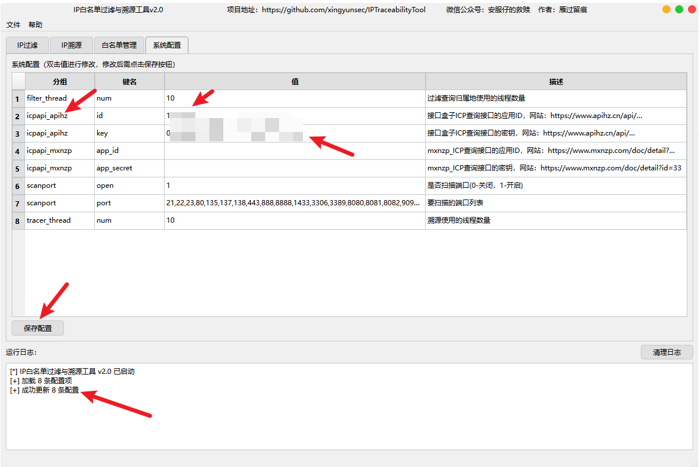
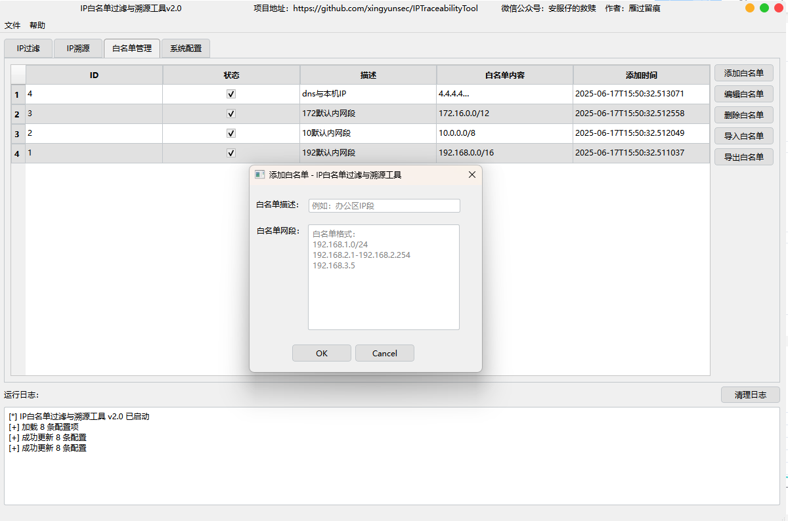

# IP白名单过滤与溯源工具V2.0使用说明

**温馨提示：**

该工具运行时不会使用本机主动对目标IP进行扫描，但是会调用第三方接口，所以会存在对互联网发送大量HTTP请求情况，使用时请保持网络畅通，如果网络环境比较特殊的场景下请勿使用该工具，避免引起不必要的麻烦。

后门？工具不会收集用户任何信息，请放心使用，不存在任何后门。请勿以谣传谣，使用时注意hash核对。

**免责声明：**

此工具仅限于学习交流，请在下载后24小时内删除，请勿非法使用该工具，用户承担因使用此工具而导致的所有法律和相关责任！作者不承担任何法律责任！

#### 文件hash：

MD5 的 IPTraceabilityToolV2.0.exe 哈希:74bc8afab025f4eb0eedc5b950a58380

国内下载源：

微云：https://share.weiyun.com/K4Pmkrpw

# 一、工具背景

背景：

1、防止攻防期间误封客户业务IP。

2、在攻防演练期间，对于重保值守人员，某些客户要求对攻击IP都进行分析溯源，发现攻击IP的时候，需要针对攻击IP进行分析，如果有关键信息输出报告，针对该需求，产生了这个工具。

# 二、功能实现

实际功能是在去年发布的V1.2命令行版本上新增，核心功能通过溯源扩展，增加GUI。

项目地址：https://github.com/xingyunsec/IPTraceabilityTool

1、可导入或单条添加自定义白名单，复制IP从白名单中进行过滤，单次最多支持1000IP；

2、支持对过滤后的非白名单IP一键溯源，主要溯源内容：归属地、端口、IP绑定域名、域名whois、域名ICP备案。

3、支持对溯源后的IP批量导出html报告、批量导出excel。

4、支持对溯源结果进行筛选、搜索、排查。

5、支持对过滤之后的白名单增加归属地复制。

# 三、使用手册

1、程序运行后，需要在系统配置里面配置API，一共2个接口需要配置：

1）接口一：https://www.apihz.cn/?shareid=10005200
可以走我的邀请码，或者直接删除后面的邀请码，打开网站后注册

注册后访问接口：https://www.apihz.cn/api/wangzhanicp.html

如下图，就能得到你自己的key。

将id和key填入系统配置的：icpapi_apihz，然后点击保存配置即可。

2）接口2：https://www.mxnzp.com?ic=WNH5MJ

可以走我的邀请码，或者直接删除后面的邀请码。登录网站：

在后台找到：APP_ID和APP_SECRET

将其填写至系统配置的icpapi_mxnzp，然后点击保存配置即可：

2、可以点击添加白名单按钮添加单条白名单。

3、如果需要导入多网段白名单，可以选择excel导入或者json导入：

点击到名单，选择已经编辑好的白名单

导入后会展示在白名单管理里面，选择状态可以将白名单禁用或启用。

注意：提取IP地址按钮是将输入的IP全部再次提取，不会经过白名单，如果要提取非白名单地址，请点击复制非白名单IP。

4、过滤IP：选择勾选归属地后，过滤之后可以点击复制非白名单地址，会将归属地放到IP地址后面。如果不需要归属地，则可以在复制前去掉显示归属地选项，提取IP地址是将所有IP地址全部提出，不经过白名单过滤。

5、点击溯源按钮后，会对输入的IP先进行过滤，然后将非白名单IP再进行溯源分析

6、溯源结果可以筛选绑定了域名的IP，还可筛选未绑定域名的IP，可以筛选后将其清空，如下图，可以选择指定IP导出溯源报告。

7、如果查询到了域名，icp等信息，都将在溯源报告中展示。

8、可将未溯源到域名的结果过滤后清空，只留下绑定了域名的IP。

9、如下图，IP溯源到了绑定的域名，然后域名查到了whois信息和ICP备案信息导出后的报告。

10、最后，可以在系统配置里面配置你需要扫描的端口信息和溯源线程数量、过滤线程数量

# 四、关于我

工具问题可反馈至：https://support.qq.com/product/661923

如有问题可在微信公众号留言反馈：

如果需要进一步交流，可加入群聊：

如需源码或其他事项沟通，请加微信：

# 五、Q&A

1、目前不支持调用微步查询IP是否为恶意，因为没钱开会员。

2、也不支持fofa、hunter等引擎的搜索，因为我也没会员。

3、程序仅支持win10、win11，因为使用的开发环境版本过高，已停止对win7的支持。

4、请勿启动代理后使用软件，这样会导致查询第三方API失败，导致结果不准确。
